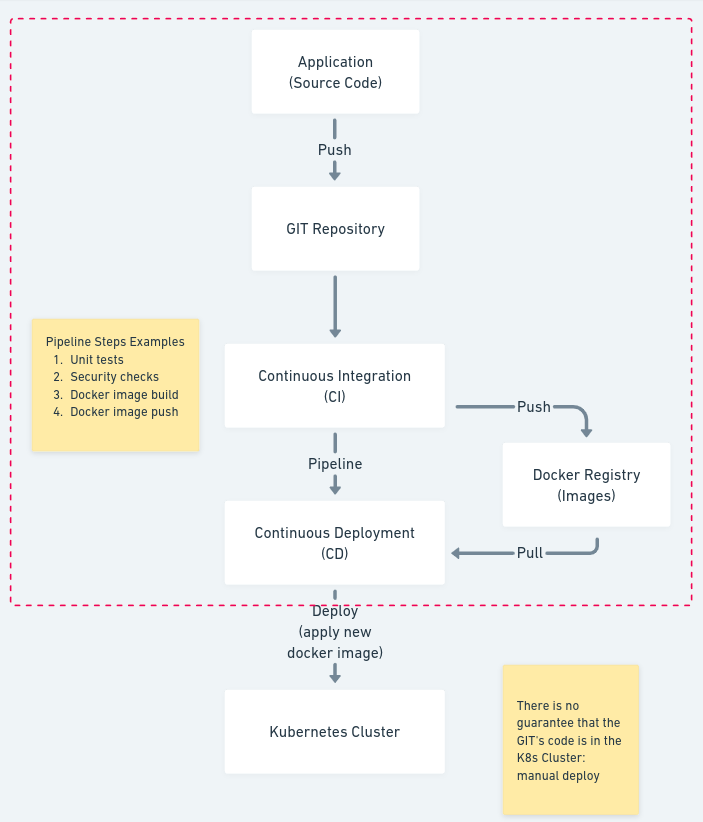
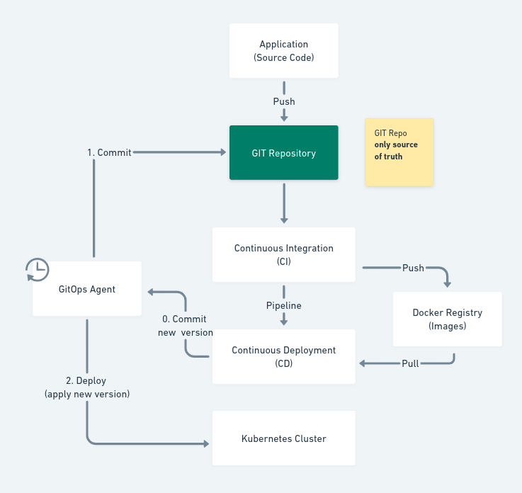
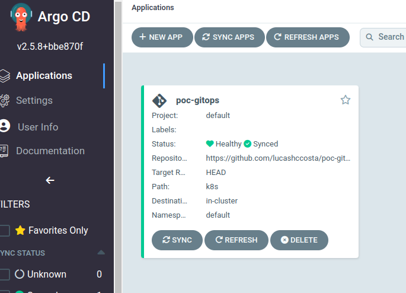
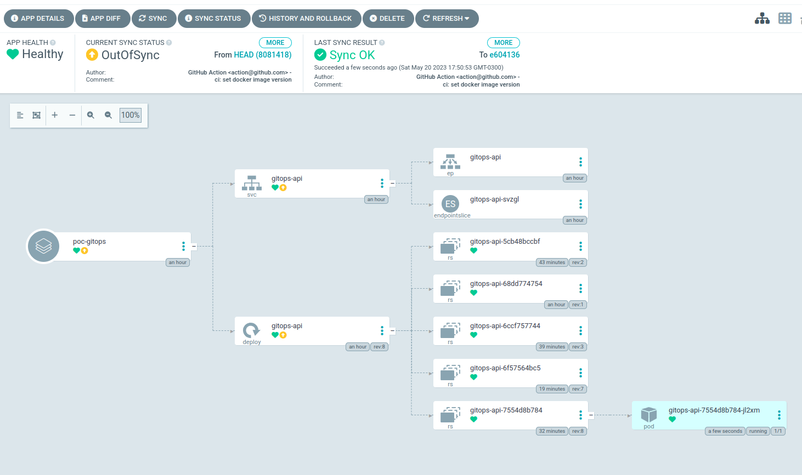
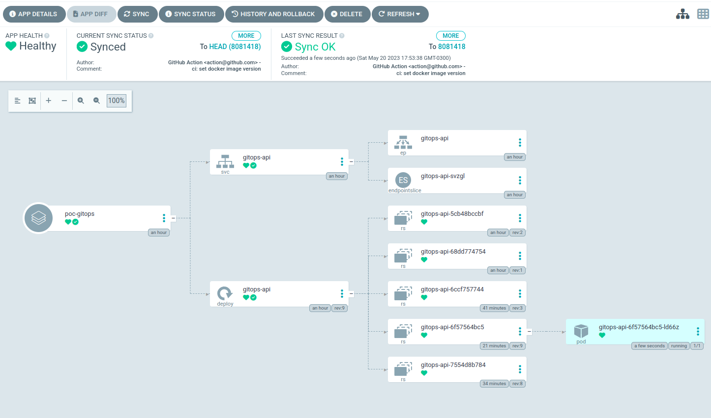

# GitOps

> Usando o Git como a “única fonte de verdade”!

Este repositório apresenta uma aplicação Rest API (`/api`), os arquivos Kubernetes para deploy da aplicação (`/k8s`) e 
o arquivo de configuração da pipeline CI/CD (`/.github/workflows/cd.yml`).

## Tecnologias

* Node.js 20
* Express Framework
* GitHub Actions
* Kubernetes 
* Kustomize.io K8s
* Docker
* ArgoCD
* Minikube

## Abordagem tradicional de CI/CD X GitOps

No processo tradicional de CI/CD não existe garantia (realização de deploy manual) de que a versão do código que está na 
branch principal (__master/main__) no repositório GIT é a que está entregue no cluster Kubernetes, porque existe um 
isolamento entre o repositório e o cluster.



Para contornar o problema, a ideia central do **GitOps** é:
```
Ter um repositório git que contém descrições declarativas da infraestrutura desejada no ambiente de deploy e ter um 
processo automatizado para fazer o ambiente de deploy corresponder ao estado descrito naquele repositório.
```

Para isso, no processo de CI/CD é inserido um agente intermediário (ArgoCD) que é responsável por escutar as mudanças 
de versões do repositório e realizar o deploy no cluster Kubernetes.



## ArgoCD

Para este estudo, o ArgoCD foi utilizado como o agente de GitOps. No seu painel, a aplicação foi configurada.



A cada finalização da pipeline de CI/CD do repositório configurado, o ArgoCD irá acusa que o status do cluster K8s está 
**OutOfSync**, indicando que o cluster K8s não contém as últimas atualizações da branch configurado (__main/master__), 
ou seja, o arquivo `k8s/kustomization.yml` foi atualizado com uma nova versão da imagem docker.s



Após selecionar Sync, o cluster K8s ficará com a nova versão da imagem docker.


